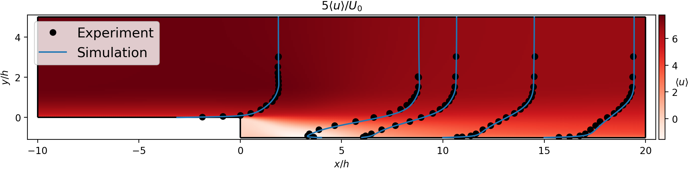

turbulucid
==========

.. image:: https://travis-ci.org/timofeymukha/turbulucid.svg?branch=master
    :target: https://travis-ci.org/timofeymukha/turbulucid

What?
-----

Turbulucid is a package for post-processing two-dimensional cell-centered VTK
polyData.
The main use case is envisioned to be analysis of cut-plane data coming from
finite-volume based solvers for Computational Fluid Dynamics.
The package contains functions for both plotting the data and data
introspection.

Why?
----

VTK has become a popular format for storing unstructured datasets
(both 3d and 2d).
The API of VTK and software such as Paraview already provide the means for
working with VTK data, so why the need for a new package?
The answer is that while the above-mentioned tools are excellent for general
inspection of large 3d datasets, they do not provide the means for producing
*publication-quality* plots of 2d data.
An example of such a plot, produced with turbulucid, is shown below.

.. _fig-cover:

Also, while VTK provides an abundance of filters for extracting specific
parts of a dataset, the object-oriented API is hard to learn and quite verbose.
Turbulucid provides easier access to the data and a set of functions for
performing simple extractions.

How?
----

Under the hood turbulucid uses VTK to handle the data, but exposes everything
to the user in terms of numpy arrays.
The plotting functions use matplotlib, and return associated matplotlib
objects.
This allows the user to harness the full customization power of matplotlib
to make the plots look exactly as desired.

Installing
----------
Turbulucid is tested using both Python 3 and 2, but using Python 3 is recommended.
It should work on any platform, where the packages described below also work.
It has been used extensively on both Windows and Linux.
Travis CI is used to test for possible installation errors after each commit.

For turbulucid to work, several other packages have to installed.
Four packages are :code:`numpy`, :code:`scipy`, :code:`matplotlib`, and :code:`pytest`.
These are easy to obtain and are part of many python distributions, in
particular, Anaconda.

Turbulucid also depends on python bindings for VTK, i.e the :code:`vtk` package.
The version of VTK should be at least 7.0.0.
With Anaconda, VTK can be obtained by running
:code:`conda install vtk` in the terminal.
Currently, this installs version 8.1.1 of the software.

Installing the package is easy.
Simply clone the git repository or download it as an archive and then unpack.
Then navigate to the root catalog of the code in a terminal and execute
:code:`python setup.py install`.
This may require root priviliges, if you lack them, the :code:`--user` flag can be used.
Alternatively, the :code:`--prefix` flag can be used to directly specify the installation path.

Using :code:`conda`, it is possible to test the package in a separate environment::

   conda create -n test-environment python=2.7 numpy scipy matplotlib pytest
   source activate test-environment
   conda install vtk
   python setup.py install
   
For more info regarding Anaconda environments refer to `<https://conda.io/docs/user-guide/tasks/manage-environments.html>`_

Validation
----------

Turbulucid comes with a number of unit tests, covering part of its functionality.
Expanding the test suite is a work in progress.
The tests are ran on Travis after each commit.
To run the tests on your machine, go to the top-level directory of turbulucid and run :code:`pytest tests`.

The best way to validate the functionality is to apply turbulucid to post-processing some simple dataset, which can also be opened in another software in order to compare results.
To that end, three datasets are provided in the turbulucid/datasets folder.
All are stored as .vtm VTK files that can also be opened in e.g. Paraview.

Dive in!
--------
A great place to learn how to use the package is the tutorial availble in `docs/tutorial <https://github.com/timofeymukha/turbulucid/blob/master/docs/tutorial/turbulucid_tutorial.ipynb>`_.
You can view the tutorial directly in the browser.
To run it on your machine, you need to install Jupyter, please refer to `<https://jupyter.org>`_ for associated documentation.

A compilation of all the docstrings is availble at the project's `Github pages <https://timofeymukha.github.io/turbulucid/>`_.

Legal information
-----------------

Turbulucid is free software and is provided under the `GNU GPL
Version 3 <http://www.gnu.org/licenses/gpl-3.0.en.html>`_.
See LICENSE.txt for the full text of the license.

The copyright to the code and documentation belongs to the author,
Timofey Mukha.

Please take special notice of the following disclaimers.

Disclaimer of warranty
~~~~~~~~~~~~~~~~~~~~~~

THERE IS NO WARRANTY FOR THE PROGRAM, TO THE EXTENT PERMITTED BY APPLICABLE
LAW. EXCEPT WHEN OTHERWISE STATED IN WRITING THE COPYRIGHT HOLDERS AND/OR
OTHER PARTIES PROVIDE THE PROGRAM “AS IS” WITHOUT WARRANTY OF ANY KIND,
EITHER EXPRESSED OR IMPLIED, INCLUDING, BUT NOT LIMITED TO, THE IMPLIED
WARRANTIES OF MERCHANTABILITY AND FITNESS FOR A PARTICULAR PURPOSE. THE
ENTIRE RISK AS TO THE QUALITY AND PERFORMANCE OF THE PROGRAM IS WITH YOU.
SHOULD THE PROGRAM PROVE DEFECTIVE, YOU ASSUME THE COST OF ALL NECESSARY
SERVICING, REPAIR OR CORRECTION.

Limitation of liability
~~~~~~~~~~~~~~~~~~~~~~~

IN NO EVENT UNLESS REQUIRED BY APPLICABLE LAW OR AGREED TO IN WRITING WILL
ANY COPYRIGHT HOLDER, OR ANY OTHER PARTY WHO MODIFIES AND/OR CONVEYS THE
PROGRAM AS PERMITTED ABOVE, BE LIABLE TO YOU FOR DAMAGES, INCLUDING ANY
GENERAL, SPECIAL, INCIDENTAL OR CONSEQUENTIAL DAMAGES ARISING OUT OF THE
USE OR INABILITY TO USE THE PROGRAM (INCLUDING BUT NOT LIMITED TO LOSS OF
DATA OR DATA BEING RENDERED INACCURATE OR LOSSES SUSTAINED BY YOU OR THIRD
PARTIES OR A FAILURE OF THE PROGRAM TO OPERATE WITH ANY OTHER PROGRAMS),
EVEN IF SUCH HOLDER OR OTHER PARTY HAS BEEN ADVISED OF THE POSSIBILITY OF
SUCH DAMAGES.

